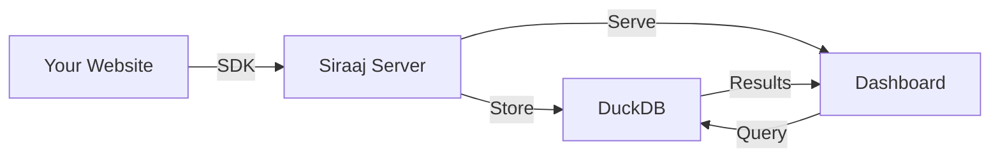

# Introduction

Welcome to **Siraaj Analytics** - a fast, simple, and self-hosted analytics platform that respects user privacy while delivering powerful insights.

## What is Siraaj?

Siraaj is a lightweight, privacy-focused analytics platform built with Go and DuckDB. It provides real-time insights into your web traffic without compromising user privacy or relying on third-party services.

## Key Features

### 🔒 Privacy First
- No cookies or third-party tracking
- Fully GDPR compliant
- All data stored on your infrastructure
- Respects Do Not Track (DNT) headers

### ⚡ Lightning Fast
- Powered by DuckDB's columnar storage
- Sub-50ms query performance
- Real-time data processing
- Efficient data compression

### 📊 Comprehensive Analytics
- Page views and unique visitors
- Session tracking and bounce rate
- Geographic insights (country-level)
- Browser, OS, and device breakdown
- Traffic sources and referrers
- Custom event tracking

### 🎨 Modern Dashboard
- Real-time updates
- Interactive charts with Chart.js
- Click-to-filter functionality
- Responsive design
- Shareable URLs with filters

### 🚀 Developer Friendly
- Simple JavaScript SDK (< 5KB)
- Framework-specific integrations (React, Vue, Svelte, Next.js, Nuxt)
- RESTful API
- TypeScript support
- Comprehensive documentation

## How It Works

1. **Integration**: Add the Siraaj SDK to your website
2. **Collection**: SDK automatically tracks page views and events
3. **Storage**: Events are stored in DuckDB for fast querying
4. **Visualization**: View insights in the beautiful dashboard

## Use Cases

- **Personal Blogs**: Understand your audience without Google Analytics
- **SaaS Applications**: Track user behavior and feature usage
- **E-commerce Sites**: Analyze conversion funnels and traffic sources
- **Marketing Agencies**: Manage multiple client websites from one instance
- **Privacy-Conscious Organizations**: GDPR-compliant analytics

## Why Choose Siraaj?

| Feature | Siraaj | Google Analytics | Plausible | Matomo |
|---------|--------|------------------|-----------|---------|
| Self-hosted | ✅ | ❌ | ✅ | ✅ |
| Privacy-focused | ✅ | ❌ | ✅ | ✅ |
| Real-time | ✅ | ⚠️ | ✅ | ✅ |
| SDK size | < 5KB | ~45KB | ~1KB | ~22KB |
| Open source | ✅ | ❌ | ✅* | ✅ |
| Cost | Free | Free/Paid | Paid | Free |

*Plausible source code is available but self-hosting has limitations

## Technology Stack

**Backend**
- Go 1.24+ - Fast, concurrent HTTP server
- DuckDB - OLAP database for analytics queries
- MaxMind DB-IP - Geolocation service

**Frontend**
- SvelteKit 2.0 - Modern UI framework
- Chart.js 4.4 - Data visualization
- Tailwind CSS - Utility-first styling
- shadcn-svelte - UI components

**SDK**
- Vanilla JavaScript/TypeScript
- UMD format (works everywhere)
- Framework adapters (React, Vue, Svelte, etc.)

## Architecture Principles

Siraaj follows **Clean Architecture** principles:

- **Domain Layer**: Business entities and logic
- **Repository Layer**: Data access abstraction
- **Service Layer**: Use cases and business rules
- **Handler Layer**: HTTP request/response
- **Middleware Layer**: Cross-cutting concerns

This ensures:
- ✅ Maintainability
- ✅ Testability
- ✅ Scalability
- ✅ Flexibility

## Next Steps

Ready to get started? Choose your path:

  
🚀 Quick Start

  
Get Siraaj running in 3 minutes

  <a href="/guide/quick-start">Quick Start Guide →</a>

  
📦 Installation

  
Detailed installation instructions

  <a href="/guide/installation">Installation Guide →</a>

  
🎯 SDK Integration

  
Add tracking to your website

  <a href="/sdk/overview">SDK Documentation →</a>

