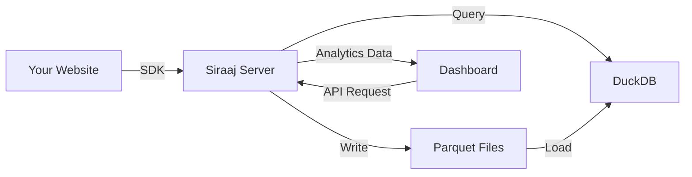

# Introduction

Welcome to **Siraaj Analytics** - a privacy-first, self-hosted analytics platform that delivers powerful insights without compromising user privacy.

## What is Siraaj?

Siraaj is a lightweight analytics platform built with Go and DuckDB. It provides real-time insights into your web traffic without cookies, third-party tracking, or relying on external services. Your data stays on your infrastructure, giving you complete control and ownership.

## Key Features

### 🔒 Privacy First
- **No cookies required** - Anonymous user/session tracking
- **GDPR compliant** - No personal data collection by default
- **Self-hosted** - Your data never leaves your infrastructure
- **Bot filtering** - Automatic detection of 50+ known bots
- **IP anonymization** - Optional country-level geolocation only

### ⚡ Lightning Fast
- **DuckDB powered** - Columnar OLAP database for sub-50ms queries
- **Parquet storage** - Efficient columnar format with compression
- **Parallel execution** - Multi-threaded query processing
- **Smart buffering** - Batched writes for high-throughput ingestion
- **Automatic optimization** - File merging and index management

### 📊 Comprehensive Analytics

**Core Metrics:**
- Page views and unique visitors
- Sessions (visits) and session duration
- Bounce rate calculation
- Real-time online users (5-minute window)
- Event tracking with custom properties

**Traffic Analysis:**
- **Channel Attribution**: Direct, Organic, Social, Referral, Paid
- **Geographic Data**: Country-level tracking
- **Technical Breakdown**: Browser, OS, device type
- **Traffic Sources**: Top referrers and domains
- **Entry/Exit Pages**: Track user journeys
- **Custom Events**: Unlimited event types with properties

**Advanced Features:**
- **Funnel Analysis**: Multi-step conversion tracking
- **Time Comparison**: Compare current vs previous periods
- **Trend Analysis**: Automatic granularity (hourly/daily/monthly)
- **Advanced Filtering**: Combine multiple filters
- **Multi-Project**: Unlimited projects from single instance

### 🎨 Modern Dashboard
- **Real-time updates** - Configurable refresh intervals (10s, 30s, 1min, 5min)
- **Interactive charts** - Built with Chart.js and D3.js
- **Click-to-filter** - Dynamic filtering on all metrics
- **Responsive design** - Works on desktop, tablet, and mobile
- **Shareable URLs** - Filter state persisted in URL parameters
- **Date ranges** - Predefined and custom date selection

### 🚀 Developer Friendly
- **Simple SDK** - < 16KB gzipped vanilla JavaScript
- **Framework support** - React, Vue, Svelte, Next.js, Nuxt, Preact
- **RESTful API** - Comprehensive HTTP API
- **TypeScript** - Full type definitions
- **Auto-tracking** - Automatic page view tracking
- **Batch API** - Efficient bulk event submission

## How It Works



1. **Integration**: Add the Siraaj SDK to your website (one script tag)
2. **Collection**: SDK automatically tracks page views and custom events
3. **Storage**: Events buffered and written to Parquet files, queried via DuckDB
4. **Visualization**: Dashboard queries API to display real-time insights

## Use Cases

- **Personal Blogs**: Understand your audience without Google Analytics
- **SaaS Applications**: Track feature usage and user behavior
- **E-commerce Sites**: Analyze conversion funnels and traffic sources
- **Marketing Agencies**: Manage multiple client websites from one instance
- **Privacy-Conscious Organizations**: GDPR/CCPA compliant analytics
- **Internal Tools**: Track application usage and performance

## Why Choose Siraaj?

| Feature | Siraaj | Google Analytics | Plausible | Matomo |
|---------|--------|------------------|-----------|---------|
| Self-hosted | ✅ | ❌ | ✅ (limited) | ✅ |
| Privacy-focused | ✅ | ❌ | ✅ | ✅ |
| Real-time | ✅ | ⚠️ Delayed | ✅ | ✅ |
| SDK size | < 16KB | ~45KB | ~1KB | ~22KB |
| Query speed | < 50ms | N/A | ~100ms | ~200ms |
| Channel attribution | ✅ | ✅ | ❌ | ✅ |
| Funnel analysis | ✅ | ✅ | ❌ | ✅ |
| Custom events | ✅ | ✅ | ✅ | ✅ |
| Open source | ✅ AGPL | ❌ | ✅* | ✅ |
| Cost | Free | Free/Paid | Paid | Free |

*Plausible is open source but self-hosting has limitations and missing features

## Technology Stack

### Backend
- **Go 1.24+** - Fast, concurrent HTTP server and business logic
- **DuckDB** - In-process OLAP database optimized for analytics
- **Parquet** - Columnar storage format with compression
- **MaxMind DB-IP** - Optional geolocation database

### Frontend
- **SvelteKit 5** - Modern reactive UI framework
- **Chart.js & D3.js** - Data visualization libraries
- **Tailwind CSS 4** - Utility-first styling
- **shadcn-svelte** - High-quality UI components

### SDK
- **Vanilla JavaScript/TypeScript** - No dependencies
- **UMD Format** - Works in all environments
- **Framework Adapters** - React, Vue, Svelte, Next.js, Nuxt, Preact

### Infrastructure
- **Docker** - Containerized deployment
- **Clean Architecture** - Testable, maintainable codebase
- **CI/CD** - Automated testing and builds

## Architecture Principles

Siraaj follows **Clean Architecture** (Hexagonal Architecture) principles:

```
┌─────────────────────────────────────────┐
│          HTTP Handlers                  │ Presentation Layer
├─────────────────────────────────────────┤
│          Service Layer                  │ Business Logic
├─────────────────────────────────────────┤
│         Repository Layer                │ Data Access
├─────────────────────────────────────────┤
│    DuckDB + Parquet Storage             │ Infrastructure
└─────────────────────────────────────────┘
```

**Benefits:**
- ✅ **Maintainability** - Clear separation of concerns
- ✅ **Testability** - Easy to mock and unit test
- ✅ **Scalability** - Components can be optimized independently
- ✅ **Flexibility** - Easy to swap implementations

## Performance Characteristics

**Throughput:**
- 10,000+ events/second (batch mode)
- 1,000+ concurrent connections
- Sub-50ms query latency (p95)

**Storage:**
- ~10KB per 1,000 events (compressed Parquet)
- Automatic file merging (< 100 files)
- Configurable buffer size (default: 10,000 events)

**Memory:**
- ~100MB base memory usage
- Configurable DuckDB memory limit (default: 4GB)
- Efficient columnar query execution

## Next Steps

Ready to get started? Choose your path:

<div class="tip custom-block">
  <p class="custom-block-title">🚀 Quick Start</p>
  <p>Get Siraaj running in 3 minutes with Docker</p>
  <a href="/guide/quick-start">Quick Start Guide →</a>
</div>

<div class="tip custom-block">
  <p class="custom-block-title">📦 Installation</p>
  <p>Detailed installation for Docker, binary, or source</p>
  <a href="/guide/installation">Installation Guide →</a>
</div>

<div class="tip custom-block">
  <p class="custom-block-title">🎯 SDK Integration</p>
  <p>Add tracking to your website in minutes</p>
  <a href="/sdk/overview">SDK Documentation →</a>
</div>

<div class="tip custom-block">
  <p class="custom-block-title">📡 API Reference</p>
  <p>Complete API documentation for custom integrations</p>
  <a href="/api/overview">API Documentation →</a>
</div>
